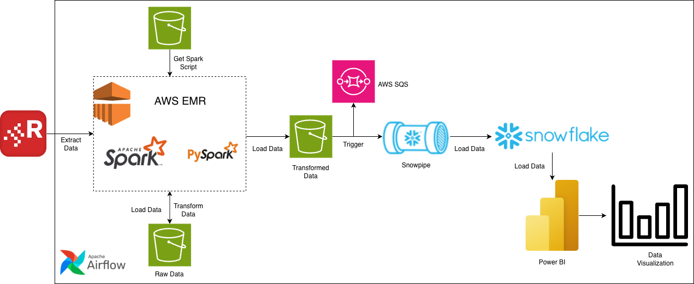
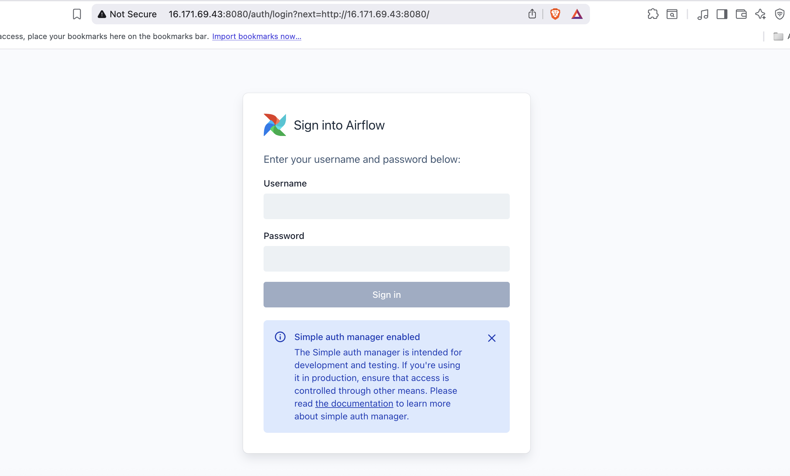
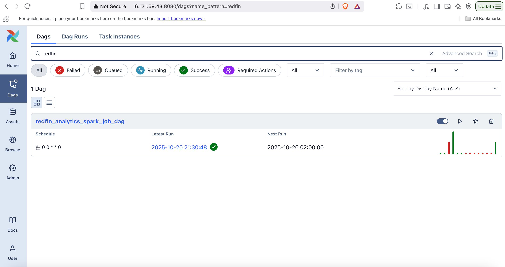
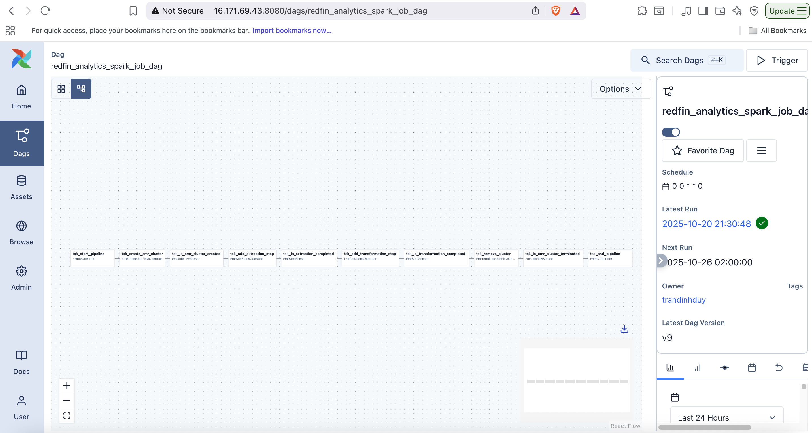
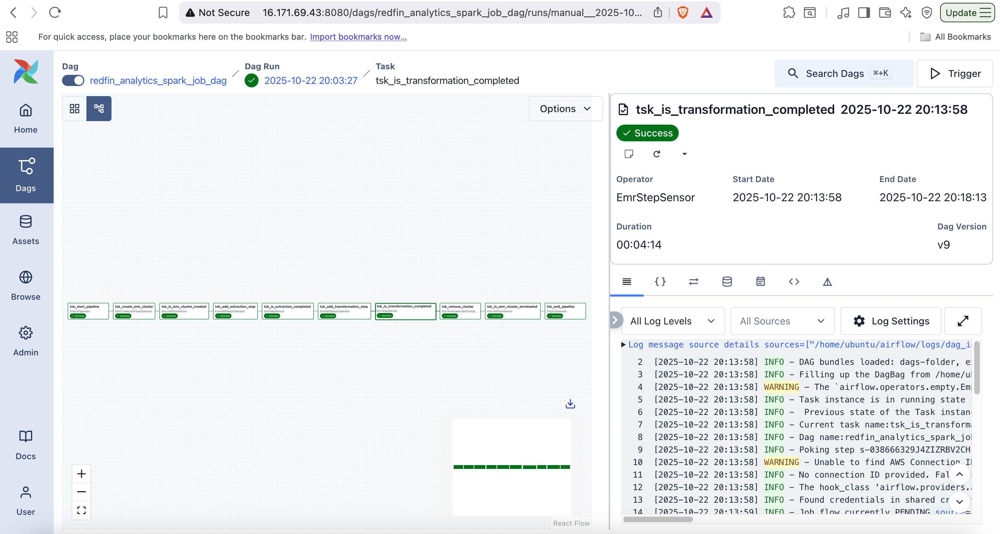

# 🚀 Redfin ETL Project

---

## Overview

This project is about extracting Redfin Real Estate data using Python and ETL process. It is a practical project by Tran Dinh Duy in his journey to become a Data Engineer.
Built with modern technologies it aims to provide eng-to-end data pipeline for extract - transform - load Redfin data.

---

## Features

- **Feature 1** – Extracting around 7.000.000 data from Redfin, a real estate brokerage, using Apache Spark built on AWS EMR, and load raw data to AWS S3.
- **Feature 2** – Transforming data using Pyspark, and using AWS S3 for storing transformed data.
- **Feature 3** – Using Snowpipe to trigger change in S3 through SQS Notification channel and load transformed data in S3 to Snowflake
- **Feature 4** – The transformed data will be load into Power BI for data visualization.
- **Feature 5** – Using Apache Airflow which runs in AWS EC2 to monitor and schedule the ETL process. 

---

## Tech Stack

| Category | Technologies |
|-----------|---------------|
| Orchestration | Apache Airflow |
| Data Visualization | Power BI |
| Database | Snowfake |
| Other | AWS S3, AWS EMR, Apache Spark, AWS VPC, AWS SQS, Snowpipe, AWS EC2 |

---

## Architecture

## Application

## Data Pipelines

